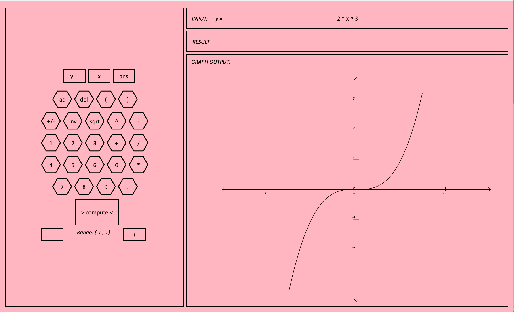

# Graphex
##### A virtual graphing calculator for the web using Functional Reactive Programming with Elm

Project Team:  Zakir Gowani, Benjamin Rohrer

We built a basic graphing calculator application in pure Elm. Basic binary arithmetic operators are supported (+, -, *, / , ^), and a basic unary operator (~, negation). 



##### Features:
- Basic binary arithmetic operators are supported (+, -, *, / , ^), and a basic unary operator (~, negation). 
- Graph mode toggle: when the “y=” string is shown in the INPUT panel, graph mode is toggled on; this means that the string in the INPUT panel will be graphed. Graph mode can either be toggled using the “y=” button or by including the variable x in the INPUT string.
- A range interval is shown below the button layout; the buttons to either side either zoom in or zoom out on the displayed graph. We cap the maximum range at (-17,17); we cap the minimum range at (-1,1).


##### Build and run with:
```
elm make Interface.elm --output=int.html
open -a Google\ Chrome int.html
```
Replace "Google\ Chrome" with your preferred browser.


This application was well-suited for a functional language.
An example of an advantage: a number of dynamically generated features of the GUI come from mappings of functions onto lists of ranges. 
The graph ticks are generated on the fly, building lists of graphics elements from lists of numbers; the plot itself is the result of mapping a domain to a list of tuples, the second element of each tuple being the output of the function application. 
Another advantage: built-in case expressions made the design of the recursive evaluation logic very straightforward. 